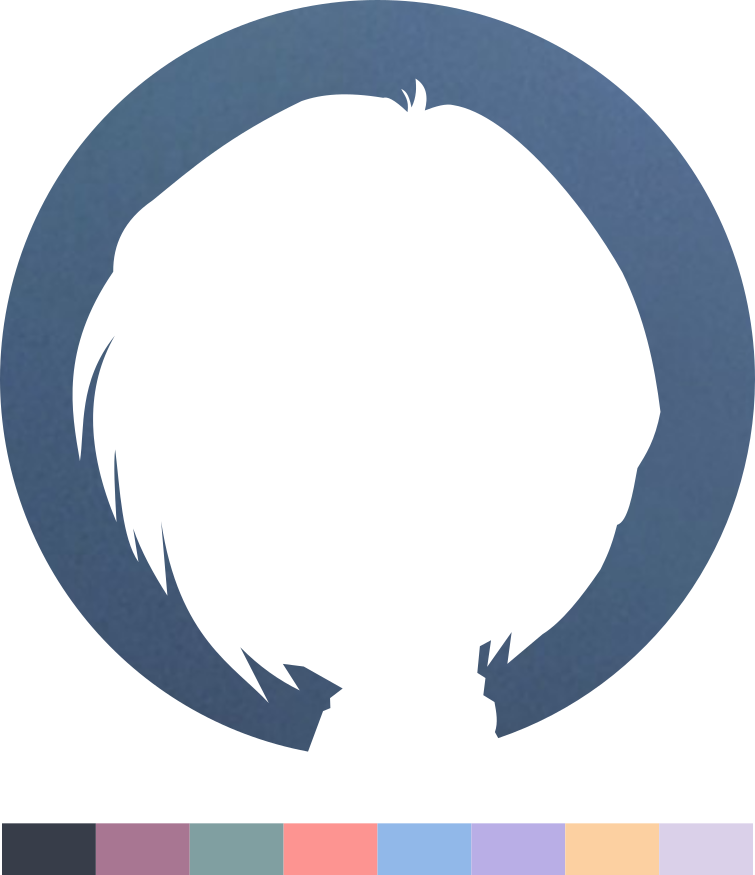

<h2 align="center">
    <br>
    rei.nvim
</h2><br>

<p align="center">
    Finally, a NeoVim theme that goes perfectly with your anime girl wallpaper.
</p><br>


# Updates

3/27/25

If you are experiencing issues with the lualine theme after updating to Neovim 0.11, please make sure lualine is up to date.

# Install

## Lazy

```lua
return {
  "wheat-thin-wiens/rei.nvim",
  priority = 1000,
  opts = {}
}
```

or, to set the colorscheme from the config:

```lua
return {
    "wheat-thin-wiens/rei.nvim",
    priority = 1000,
    config = function()
      require("rei.nvim").setup({
        -- opts go here
      })
      vim.cmd.colorscheme("rei")
    end
}
```

# Configuration

```lua
opts = {
  styles = {
    comments = { italic = true },
    keywords = {},
    identifiers = {},
    functions = { italic = true, bold = true },
    variables = {},
    booleans = {},
    loops = { italic = true }
  },
  integrations = {
    gitsigns = true,
    indent_blankline = true,
    lsp = true,
    lazy = true,
    mason = true,
    neogit = true,
    neotree = true,
    render_markdown = true,
    telescope = true,
    treesitter = true,
    which_key = true
  },
  extras = {
    terminal_colors = true,
    high_contrast = false,
    transparency = false, -- Enables / Disables background transparency
    telescope_theme = "default", --borderless theme also available
  },
  highlight_overrides = {}
}
```

# Plugin Support

`rei.nvim` currently has support for the follow plugins:

- [Git Signs](https://github.com/lewis6991/gitsigns.nvim)
- [Indent Blankline](https://github.com/lukas-reineke/indent-blankline.nvim)
- [Lazy Package Manager](https://github.com/folke/lazy.nvim)
- [Lualine](https://github.com/nvim-lualine/lualine.nvim)
- [Mason](https://github.com/williamboman/mason.nvim)
- [Neogit](https://github.com/NeogitOrg/neogit)
- [NeoVim LSP](https://github.com/neovim/nvim-lspconfig)
- [Neotree](https://github.com/nvim-neo-tree/neo-tree.nvim)
- [Render Markdown](https://github.com/MeanderingProgrammer/render-markdown.nvim)
- [Telescope](https://github.com/nvim-telescope/telescope.nvim)
- [treesitter](https://github.com/nvim-treesitter/nvim-treesitter)
- [which-key](https://github.com/folke/which-key.nvim)

...with plans for more.

If you don't see your favorite plugin listed, go ahead and make a request and I can
see about getting it added.

# Extras

Included you will also find themes for the following programs:

- btop
- ghostty
- Starship
- rofi
- waybar
- WezTerm

# Special Thanks

- [oldworld.nvim](https://github.com/dgox16/oldworld.nvim)
- [catppuccin](https://github.com/catppuccin/nvim)

