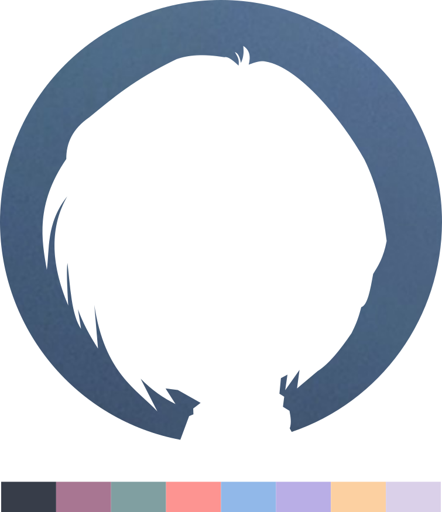
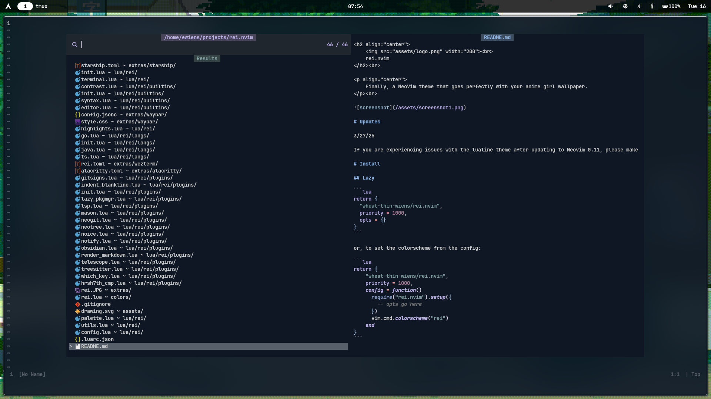

<h2 align="center">
    <br>
    rei.nvim
</h2><br>

<p align="center">
    Finally, a NeoVim theme that goes perfectly with your anime girl wallpaper.
</p><br>


# Updates

## 3/27/25

If you are experiencing issues with the lualine theme after updating to Neovim 0.11, please make sure lualine is up to date.

# Breaking Changes from Main

## Plugin settings

All plugins in `opts.integrations` have been changed from booleans to tables with enabled fields.
This allows for additional settings to be added in the future without further breaking changes.
If you have certain plugins enabled / disabled, please update your config to reflect these changes.

# Install

## Lazy

```lua
return {
  "wheat-thin-wiens/rei.nvim",
  branch = "rei2",
  priority = 1000,
  opts = {}
}
```

or, to set the colorscheme from the config:

```lua
return {
    "wheat-thin-wiens/rei.nvim",
    branch = "rei2",
    priority = 1000,
    config = function()
      require("rei.nvim").setup({
        -- opts go here
      })
      vim.cmd.colorscheme("rei")
    end
}
```

# Configuration

```lua
opts = {
  styles = {
    comments = { italic = true },
    keywords = {},
    identifiers = {},
    functions = { italic = true, bold = true },
    variables = {},
    booleans = {},
    loops = { italic = true }
  },
  integrations = {
    gitsigns         = { enabled = true },
    hrsh7th_cmp = {
      enabled = true,
      italic_highlight = false,
    },
    indent_blankline = { enabled = true },
    lazy             = { enabled = true },
    lsp              = { enabled = true },
    mason            = { enabled = true },
    neogit           = { enabled = true },
    neotree          = { enabled = true },
    noice            = { enabled = true },
    notify           = { enabled = true },
    obsidian         = { enabled = true },
    render_markdown  = { enabled = true },
    telescope = {
      enabled = true,
      theme = "default", -- "borderless" also available
    },
    treesitter       = { enabled = true },
    which_key        = { enabled = true },
  },
  extras = {
    transparency = false, -- Enables / Disables background transparency
    high_contrast = false,
    terminal_colors = true,
  },
  highlight_overrides = {}
}
```

# Plugin Support

`rei.nvim` currently has support for the follow plugins:

- [Git Signs](https://github.com/lewis6991/gitsigns.nvim)
- [Indent Blankline](https://github.com/lukas-reineke/indent-blankline.nvim)
- [Lazy Package Manager](https://github.com/folke/lazy.nvim)
- [Lualine](https://github.com/nvim-lualine/lualine.nvim)
- [Mason](https://github.com/williamboman/mason.nvim)
- [Neogit](https://github.com/NeogitOrg/neogit)
- [NeoVim LSP](https://github.com/neovim/nvim-lspconfig)
- [Neotree](https://github.com/nvim-neo-tree/neo-tree.nvim)
- [nvim-cmp](https://github.com/hrsh7th/nvim-cmp)
- [Render Markdown](https://github.com/MeanderingProgrammer/render-markdown.nvim)
- [Telescope](https://github.com/nvim-telescope/telescope.nvim)
- [treesitter](https://github.com/nvim-treesitter/nvim-treesitter)
- [which-key](https://github.com/folke/which-key.nvim)

If you don't see your favorite plugin listed, go ahead and make a request and I can
see about getting it added.

## hrsh7th_cmp

`opts.integrations.hrsh7th_cmp.italic_highlight` can be enabled to make the selected option italic for greater contrast:

Enabled:


Disabled:


## telescope

Default:


Borderless:




# Extras

Included you will also find themes for the following programs:

- btop
- ghostty
- Starship
- rofi
- waybar
- WezTerm

# Special Thanks

- [oldworld.nvim](https://github.com/dgox16/oldworld.nvim)
- [catppuccin](https://github.com/catppuccin/nvim)

